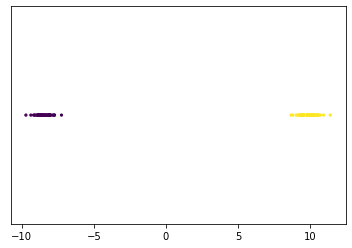
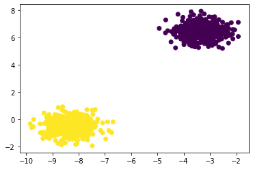

# 1D Clustering
This code takes any 1D set of datapoints and separates it into two distinct clusters using the K-means algorithm

# 2D Clustering
This code takes any 2D set of datapoints and separates it into two distinct clusters using the K-means algorithm

